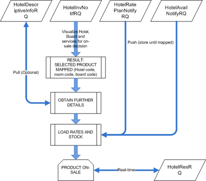
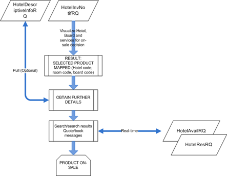

# Excursion NBC Mapping Process

The Inventory mapping process requires an interactive and highly automated „matching application“ on the partner side to quickly turn-around product changes.

The following steps are advised:

- Display portfolio changes and decide whether to incorporate the new excursion- map the services: OTA_TourActivityAvailRS
  - Excursion codes (see appendix)
  - Service codes (see appendix)
  - Extras and other services
  - Amenities
  - Date ranges and rules
- Map the excursion: OTA_ProductDescriptiveInfoRQ/RS with various switches (see OTA Communication Model documentation)
  - With Address
  - With location codes (Country, Destination, Region, Resort, Touristic destination)
  - With factsheets
  - With multimedia (image location)

Rates and availability are loaded to facilitate packaging and searches.

Schematic mapping process for Notification based model for hotel:



Schematic mapping process for Transactional model:



## Excursion – OTA_ProductDescriptiveInfoRQ

In order to request the NBC for an excursion (transactional model), it’s needed to use the OTA_ProductDescriptiveInfoRQ message. This message is very similar to the OTA_HotelDescriptiveInfoRQ

In this case, we will have a &lt;ProductDescriptiveInfos&gt; node. Inside of this node, we will specify the tour activity inside a &lt;TourActivityDescriptiveInfo&gt; node

Postman example:
**Excursion > NBC Mapping process > EXCURSION DETAILS – OTA_ProductDescriptiveInfoRQ**

## Excursion – OTA_ProductDescriptiveInfoRS

### **Purpose**

Provide information regarding contracted Products, services, extras and descriptions of these. Provide rules as to their availability and application.

### **OTA_ProductDescriptiveInfoRS information**

Excursion services can be grouped into three main concepts:

- **TourActivityID:** This concept identifies the excursion
- **Product**: This concept identifies the product offered in the excursion. I.E. 1 hour helicopter excursion, 2 hours helicopter excursion, etc
- **Service:** This concept identifies the service type. I.E. Ticket only, including pickup, etc

TourActivityID can be retrieved from TourActivityDescriptiveContent:

```xml
<TourActivityDescriptiveContent TourActivityID="XAEDXB92QK" TourActivityName="Helicopter Tour Atlantis" RPH="1">```

Products offered under the Excursion can be retrieved from the ProductInfo node, in CategoryCodes section:

```xml
<ProductInfo Code="TH000150" CodeDetail="Helicopter Tour (15 min)">
	<DescriptiveText> Helicopter Tour (15 min)</DescriptiveText>
</ProductInfo>
```

Services offered under the excursion can be retrieved from the ServiceInfo node, in CategoryCodes section:
```xml
<ServiceInfoInfo Code="TIC" CodeDetail="Ticket only">
	<DescriptiveText>Ticket</DescriptiveText>
</ServiceInfoInfo>
```

Service codes can be found in Excursion > Common > Excursion related codes

Note: all Product and service combinations may not be available, available combinations are confirmed in the Rateplan notifications.


[Go back to index]({{ site.baseurl }}/)

