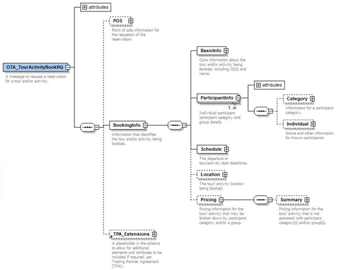
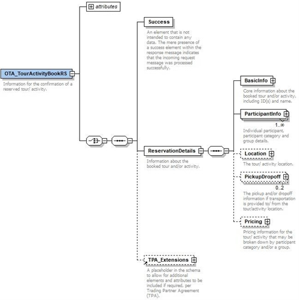

# Excursion book messages

## OTA_TourActivityBookRQ

OTA_TourActivityBookRQ is the message used for quoting and booking. Typical OTA_TourActivityBookRQ structure:



##

### Quote and Commit

The OTA_TourActivityBookRQ can also be used to make an inquiry whether a particular reservation is possible, requesting the availability and total price for the booking. The quote is requested the same way as OTA_TourActivityBookRQ, using ResStatus attribute with “Quote” value. The behavior is similar to Hotel and Transfer messages, no actual booking is requested, just the confirmation of the price and availability.

The definite booking request is sent using ResStatus with value “Commit”. If accepted by the reservation system, this is a binding commitment with possible penalties in the case of cancellations or modifications. The booking request is the exact same message as the quote request and technically the exact same modules are used. Where in case of a booking the

transaction is committed, in the “quote”, the transaction is not confirmed nor registered in our system.

###

### Service ID

Full service ID returned in a detailed search (MF001) must be provided in the booking quote/commit.

```xml
<BasicInfo TourActivityID="LESACE474M" SupplierProductCode="STD" SupplierServiceCode="XO">
```

### Participants and ages

In the Participant details section, Pax quantity and age must be indicated. Each Pax must have an ID to be identified; ParticipantID is used for this purpose. Age is important to determine the applicable rate and availability. The detail available at reservation time depends on the booking source: **age at the time of the service.** QualifierInfo Code follows OTA AQC codes (Age Qualifying code).

```xml
<ParticipantInfo>
    <Category QualifierInfo="10"/>
    <Individual Age="26" ParticipantID="1">
        <GivenName>Bender</GivenName>
        <NamePrefix>Mr</NamePrefix>
        <Surname>Bending</Surname>
    </Individual>
</ParticipantInfo>
<ParticipantInfo>
    <Category QualifierInfo="10"/>
    <Individual Age="26" ParticipantID="2">
        <GivenName>Angeline</GivenName>
        <NamePrefix>Mrs</NamePrefix>
        <Surname>Bending</Surname>
    </Individual>
</ParticipantInfo>
<ParticipantInfo>
    <Category QualifierInfo="8"/>
    <Individual Age="6" ParticipantID="3">
        <GivenName>Ben</GivenName>
        <NamePrefix>Jr</NamePrefix>
        <Surname>Bending</Surname>
    </Individual>
</ParticipantInfo>
```

### Schedule

Schedule must indicate the specific date of the service, so the period should be a single date.
```xml
<Schedule Start="2022-05-29" End="2022-05-29">
```
Pickuptime and the location of the selected service must be included as well:
```xml
<PickupDropoff DateTime="2022-07-30T00:50:00" PickupInd="true" LocationName="APTFAOBOFM">
```
### Expected Rates

Rates returned in the detailed search result are sent back in the booking request for price consistency purposes.

```xml
<Pricing>
    <Summary Amount="130.00" CurrencyCode="EUR"/>
</Pricing>
```
### Partner reference

The partner reference is a mandatory element for obvious reasons regarding voucher numbers, and also, to enable:

- Implementation of the cancel/RS with partner references
- Avoid double bookings (if a partner tries to make two bookings with the same partner reference, the system will respond “booking already exists“.
- This reference must be printed on the voucher.

```xml
<TPA_Extensions>
    <UniqueID Type="36" ID="123456789" ID_Context="Client"/>
    <UniqueID Type="37" ID="123456789_1" ID_Context="Client"/>
</TPA_Extensions>
```

Please see “Common > Real Time Messaging > 7. Master and Child references” for more information.

### Extras

Extras returned in the search request can be added to the booking, including them in the Booking request, in the Extra section. More than one extra of the same type can be added. Compulsory extras should not be included in the request as they are already included and calculated.
```xml
<Extra SupplierCode="EXFOOD" Description="Extra Food" quantity="1"/>
```
Postman example:

**Excursion > Bookings > BOOK QUOTE – OTA_TourActivityBookRQ**

**Excursion > Bookings > BOOK COMMIT – OTA_TourActivityBookRQ**

**Excursion > Bookings > BOOK PRICEBREAKDOWN – OTA_TourActivityBookRQ**

## OTA_TourActivityBookRS

The Quote response message will confirm the availability of the service and the final cost of the service. The Commit will do the final booking as well.

If the booking is not possible or if there was an error processing the request, an OTA_TourActivityBookRS with no <Success/>; element is sent and the error message will detail the problem that occurred in <Errors/>. A List of the most common errors can be found in Common > Errors & Troubleshooting.

Typical OTA_TourActivityBookRS structure:


##

### Service ID and Location

Service ID and location values are returned as confirmation info.
```xml
<BasicInfo TourActivityID="XESPMIAZ9U" SupplierProductCode="TE0CC00A"    SupplierServiceCode="TRF"/>
<Location Context="Service">
    <Region RegionCode="Region">Mallorca</Region>
</Location>
```

###

### Participants

In the Participant details section, Pax quantity and age must be indicated. Age is important to determine the applicable rate and availability. The detail available at reservation time depends on the booking source: **age at the time of the service.** QualifierInfo Code follows OTA AQC codes (Age Qualifying code), and this attribute is also mandatory.
```xml
<ParticipantInfo>
    <Category QualifierInfo="10"/>
    <Individual Age="36" ParticipantID="1">
        <GivenName>Bender</GivenName>
        <NamePrefix>Mr</NamePrefix>
        <Surname>Bending</Surname>
    </Individual>
</ParticipantInfo>
```

### Rates

Pricing confirmation will be included in Service and TotalCharge the same way as OTA_TourActivityAvailRS, details on the calculation is provided in ServiceCharges section. Prices shown in the <Summary> section are final and will be the ones considered for accountancy.
```xml
<Pricing>
    <Summary Amount="130.00" CurrencyCode="EUR"/>
    <Group KnownGroupsize="3"/>
</Pricing>
```

### Partner and Axisdata references

Client reference number and Axisdata internal reference numbers can be found in <TPA_Extensions> section. The client reference will use the master and child references.
```xml
<TPA_Extensions>
    <UniqueID Type="36" ID_Context="Client" ID="1234567890"/>
    <UniqueID Type="36" ID_Context="Internal" ID="121212121212"/>
    <UniqueID Type="37" ID_Context="Client" ID="1234567890_1" />
    <UniqueID Type="37" ID_Context="Internal" ID="1"/>
</TPA_Extensions>

```

Both, client and internal references, can be used for cancellation process, but Client value should be used for any other communications (printed vouchers, accountancy, etc).

See also “Common > Real Time Messaging > 7. Master and Child references”

### Cancel penalties

For each OTA_TourActivityBookRQ (both of the type “quote” and the type “commit”), the cancellation policy is included in the OTA_TourActivityBookRS. Structure is similar to the Hotel cancellation rules and section is included in the TPA_Extensions section.
```xml
<CancelPenalties>
    <CancelPenalty>
        <Deadline OffsetUnitMultiplier="24" OffsetTimeUnit="Hour" OffsetDropTime="BeforeArrival"/>
        <AmountPercent Percent="50" BasisType="FullStay"/>
    </CancelPenalty>
    <CancelPenalty>
        <Deadline OffsetUnitMultiplier="72" OffsetTimeUnit="Hour" OffsetDropTime="BeforeArrival"/>
        <AmountPercent Percent="5" BasisType="FullStay"/>
    </CancelPenalty>
</CancelPenalties>
```
Full cancellations can be performed using both Axisdata or partner reference. To perform a partial cancellation, specific child reference should be used.

### Extras

Extras included in the booking will be returned in the response as a confirmation of its inclusion. Extra rates are already included in the TotalCharge value.

<Extra SupplierCode="EXFOOD" Description="Extra Food" quantity="1"/>

### QR Codes

The excursion provider may dispose of QR codes related to the booked activity. If it does, there are two ways for the providers to send the QR codes back:

**Direct value of the QR Code**: the string provided in the response must be transformed into a QRCode. Value provided as a UniqueID element under the TPA_Extensions element in the booking response.

Type                     Attribute that hosts the model, standard OTA UIT code with value 30 (ticket)

ID                          Attribute that hosts the value of the QR Code

ID_Context        Attribute that hosts the context of the code, value is not relevant and has a fixed value of “Client”
```xml
<TPA_Extensions>
<CancelPenalties>
…
</CancelPenalties>
<UniqueID Type="36" ID_Context="Client" ID="abcd"/>
<UniqueID Type="36" ID_Context="Internal" ID="10326302"/>
<UniqueID Item_RPH="1" ID="abcd_1" Type="37" ID_Context="Client"/>
<UniqueID Item_RPH="1" ID="1" Type="37" ID_Context="Internal"/>
<UniqueID Type="30" ID_Context="Client" ID="/OI/P1437/I0/AN002137/E176/N001/B003/J1/F210605/H1600/G51/R1:Y2-B3-F210605-H1600"/>
<ns1:BookingStatus
            xmlns:ns1="http://www.opentravel.org/OTA/2003/05/tpa"
            xmlns:xsi="http://www.w3.org/2001/XMLSchema-instance" xsi:type="ns1:BookingStatusType" ReservationStatusType="Reserved"/>
</TPA_Extensions>
```

**URL of the QR code**: The value provided is an URL that needs to be accessed to download the QRCode.

Value provided as a UniqueID element under the TPA_Extensions element in the booking response.

Type                     Attribute that hosts the model, standard OTA UIT code with value 30 (ticket)

ID                          Attribute that hosts the value of the QR Code

ID_Context        Attribute that hosts the context of the code, value its not relevant and has a fixed value of “Client”
```xml
<TPA_Extensions>
<CancelPenalties>
…
</CancelPenalties>
<UniqueID Type="36" ID_Context="Client" ID="abcd"/>
<UniqueID Type="36" ID_Context="Internal" ID="10326302"/>
<UniqueID Item_RPH="1" ID=" abcd _1" Type="37" ID_Context="Client"/>
<UniqueID Item_RPH="1" ID="1" Type="37" ID_Context="Internal"/>
<UniqueID Type="30" ID_Context="Client" ID="https://pre-portaventuraworld.api.experticket.com/TransactionDownload/SalesDocument?SaleId=5603191358506446612" />
<ns1:BookingStatus
            xmlns:ns1=http://www.opentravel.org/OTA/2003/05/tpa
            xmlns:xsi=http://www.w3.org/2001/XMLSchema-instance xsi:type="ns1:BookingStatusType" ReservationStatusType="Reserved"/>
</TPA_Extensions>
```


[Go back to index](/Excursion/index.md)
