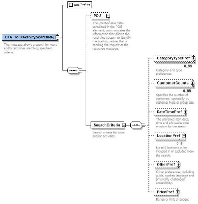
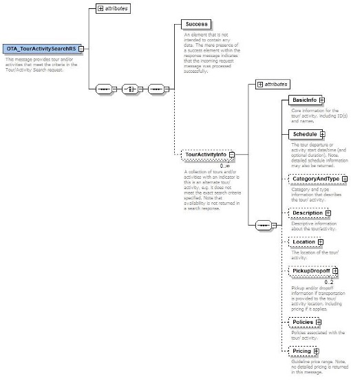
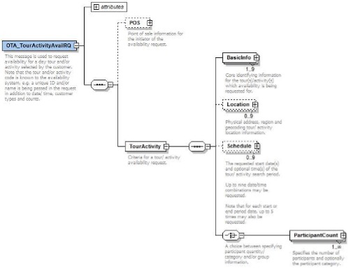
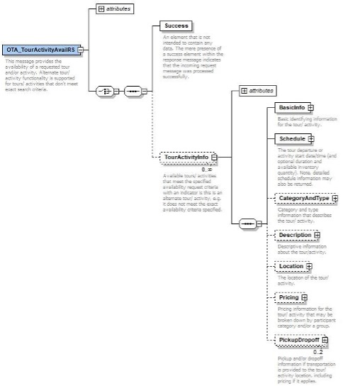

# Excursion search and avail messages

The use of the OTA_TourActivityxxx messages returns pricing in the response, based on Excursion and Ticketing agreements available to the client in our TravelKISS plaform.

Excursion flow is similar to previous ones (Transfer, Rent a car) keeping the same search- quote-book process but it includes an additional message to get the inventory descriptions in realtime. This step is optional and it is not required to have a fully functional excursion integration. The OTA messages used are:

Real-time inventory descriptions: OTA_TourActivitySearchRQ/RS Real-time price search: OTA_TourActivityAvailRQ/RS

Real-time quote and book: OTA_TourActivityBookRQ/RS

OTA Tour Activity messaging pack is based on 2016.b specification, so version for all OTA Vehicle messages is Version=”2016.b”. Message implementation is based on OTA with some extra functionality included.

## OTA_TourActivitySearchRQ

**OTA_TourActivitySearchRQ** is the message used for searching available services with pricing. Typical **OTA_TourActivitySearchRQ** structure:




### Location

Service location specifies the areas involved in an excursion service. Source location indicates the customer’s location at the start of the service. Typical value would be the stay hotel or the touristic destination. The source location is needed for service and transfer availability, pickup location and pickup time calculation. Service location indicates the area of the requested services. Typical value would be the region or resort. The location Context attribute is an extension over the OTA standard.
```xml
<LocationPref Context="Source">
<LocationPref Context="Service">
```
Location structure allows different types of location types:

- Areas: Country, Destination, region, resort and Touristic destination.
- Hotel code or GIATA code (Usable by GIATA partners only)
- Geo Location
- TourActivity Code
```xml
<LocationPref Context="xxxx">
    <Region RegionCode="Country">Spain</Region>
    <Region RegionCode="Region">Mallorca</Region>
    <Region RegionCode="Resort">Arenal</Region>
    <Region RegionCode="HotelCode">AMTSxxxx</Region>
    <Region RegionCode="GIATA">25412</Region>
    <Region RegionCode="Product">LESPMIBKUI</Region>
    <Position Latitude="12541" Longitude="25412"/>
</LocationPref>
```
Only one of the location types should be used for each location, it is not necessary to be the same. I.E. Source location can be a hotel code and service location can be a region. In case the location is defined per area, Country should be always provided. I.E. Country + Region, Country + Resort, etc.
```xml
<LocationPref Context="Source">
    <Region RegionCode="HotelCode">AMTSxxxx</Region>
</LocationPref>
```

```xml
<LocationPref Context="Service">
    <Region RegionCode="Country">Spain</Region>
    <Region RegionCode="Region">Mallorca</Region>
</LocationPref>
```
Source locations allowed: Area (Country, Region, Resort), GIATA code, Hotel Code or Geo Location

Destination locations allowed: Area (Country, Region, Resort), TourActivity Code

### Rate Delimiter

This concept defines a range or limit of budget. **MaxPrice** is the highest price for a price range search while **MinPrice** is the lowest. The pricing type might be per person and per group.
```xml
<PricePref MaxPrice = "100">
    <PricingType>PerPerson</PricingType>
</PricePref>
```

### Date and Time Preferences

DateTimePref contains the date range to be used in the excursion service search. This period normally covers the hotel stay. Period is limited to 28 days. Duration can be included to indicate the maximum duration of the requested services.
```xml
<DateTimePref Start="2022-08-01" End="2022-08-15" Duration="P6h"/>
```
### Category Preferences

CategoryTypePref contains the preferred excursion categories to be returned in the search, this section is optional. Values can be found in the Appendix section.
```xml
<CategoryTypePref>
    <Category>Ticket</Category>
    <Type>Adventure</Type>
</CategoryTypePref>
```
### Language preferences

Spoken language can be requested to fit the customer spoken language. Language code follows ISO 3166-1 alpha-2 codes.
```xml
<OtherPref>
    <SpokenLanguage Code="EN"/>
</OtherPref>
```
### Availability Notification

For Excursions contracts, an availability is notified with Delta notifications when the client has been added to a new contract, or the existing contract has been amended also by activating or deactivating stop sales.

Excursion allotment is notified per product, not per contract.

Postman example:
**Excursion > Search & Avail > SEARCH ALL - OTA_TourActicitySearchRQ**
**Excursion > Search & Avail > SEARCH SPEC - OTA_TourActicitySearchRQ**

## OTA_TourActivitySearchRS

An OTA_TourActivitySearchRS message is received in response to the request. The presence of the <Success/> element indicates successful processing of the request; otherwise, a list of errors is returned. In case no services are available for the requested parametes, the result will have an empty list.

The response will contain all the services provided in the area requested, it’s availability and pricing is not calculated.

Typical OTA_TourActivitySearchRS structure:



### Service ID

Service ID defines the main excursion product. This code will be used during search-book flow.
```xml
<BasicInfo TourActivityID="LESACE474M" SupplierProductCode="STD" SupplierServiceCode="XO"/>
…
<BasicInfo TourActivityID="LESACE474M" SupplierProductCode="STD" SupplierServiceCode="XA"/>
…
<BasicInfo TourActivityID="LESACEA123" SupplierProductCode="STD" SupplierServiceCode="XO"/>
…
<BasicInfo TourActivityID="LESACEA123" SupplierProductCode="STD" SupplierServiceCode="XA"/>
…
```
### Schedule

It contains the date range period in which the service is available. Duration of the service (if available) is expressed as an XML duration type.
```xml
<Schedule>
    <Summary End = "2022-06-23" Start = "2022-06-01" Duration = "PT4H"/>
</Schedule>
```
### Categories

This section describes the type of excursion and its category. Type codes can be found in Appendix I at the end of the documentation. Category code can be either “Excursion” or “Ticket”. An excursion service includes the transfer service from the source location to the service location, a ticket only includes the entrance and it does not include the transfer to the service location.
```xml
<CategoryAndType>
    <Type Code="Adventure"/>
    <Category Code="Excursion & Activities"/>
</CategoryAndType>
```
### Description

Main description of the excursion can be found in the Long Description section. The description language will be English, to be extended in the future.
```xml
<Description>
    <LongDescription>Excursion Soller
    …
    </LongDescription>
</Description>
```
### Facts

Activity facts can be found in the response as text item elements. Fact categories and codes can be found in:

Excursion > XA_Common > Excursion_Related_Codes > 5. Activity codes
```xml
<TextItem Category = "EX_TARGET" SourceID = "EX_TARGET_ALL">
    <Description>Anybody</Description>
</TextItem>
```

### Location

This section will include the full-service location. Location types and structure will be the same used in the OTA_TourActivityAvailRQ.
```xml
<Location>
    <Region RegionCode = "Country">Spain</Region>
    <Region RegionCode = "Region">Mallorca</Region>
    <Region RegionCode = "Resort">Calvia</Region>
</Location>
```

### Cancellation rules

For each service available, the cancellation policy is included in the response. Structure is similar to the Hotel cancellation rules and section is included in the TPA_Extensions section.
```xml
<Policies>
    <CancelPolicy>
        <CancelPenalty>
            <Deadline OffsetUnitMultiplier="2" OffsetTimeUnit="Day" OffsetDropTime="BeforeArrival"/>
            <AmountPercent BasisType="FullStay" Percent="50"/>
        </CancelPenalty>
        <CancelPenalty>
            <Deadline OffsetUnitMultiplier="0" OffsetTimeUnit="Day" OffsetDropTime="BeforeArrival"/>
            <AmountPercent BasisType="FullStay" Percent="100"/>
        </CancelPenalty>
    </CancelPolicy>
</Policies>
```

### Participant rules

The amount and type of participants that are eligible for the service are indicated in the Participant section under the policies node.
```xml
<Participant MaxParticipants="10" MinParticipants="2" MinADT="2" MaxADT="6" MinCHD="0" MaxCHD="2" MaxINF="0" MaxCHDAge="6" />
```
### Expected Rates

Rates returned in the detailed search result are sent back in the booking request for price consistency pourposes.
```xml
<Pricing>
    <Summary Amount="130.00" CurrencyCode="EUR"/>
</Pricing>
```
## OTA_TourActivityAvailRQ

OTA_TourActivityAvailRQ is the message used for searching available services with pricing. Typical OTA_TourActivityAvailRQ structure:



### All services and cheapest service

To facilitate applications where the workflow is oriented to an initial search results display of one result per service, we do offer the possibility to get the cheapest price per service. A next step specifying the product code in the search request, allows the end user to specify the dates/options. This is an efficient approach in terms of data volume.

Instance MF001 returns all services + all schedules available
```xml
<RequestorID ID="TEST" ID_Context="AxisData" Type="22" Instance="MF001"/>
```
Instance MF002 returns all services with the cheapest price
```xml
<RequestorID ID="TEST" ID_Context="AxisData" Type="22" Instance="MF002"/>
```
The most efficient way to perform a service search is executing an initial search to retrieve all available services (MF002) with the cheapest value. Once a service has been selected, a second request to get all schedules and prices (MF001) for the specific service can be executed.

### Location

See description in OTA_TourActivitySearchRQ, but <LocationPref> has to be changed with <Location>.

### Schedule

Service Schedule contains the date range to be used in the excursion service search. This period normally covers the hotel stay. Period is limited to 28 days.
```xml
<Schedule StartPeriod="2022-05-25" EndPeriod="2022-05-30"/>
```
### Participants and ages

In the Participant details section, Pax quantity and age must be indicated. Age is important to determine the applicable rate and availability. The detail available at reservation time depends on the booking source: **age at the time of the service.** QualifierInfo Code follows OTA AQC codes (Age Qualifying code).
```xml
<ParticipantCount Quantity="2">
    <QualifierInfo>10</QualifierInfo>
</ParticipantCount>
<ParticipantCount Quantity="1" Age="6">
    <QualifierInfo>8</QualifierInfo>
</ParticipantCount>
```
### Rate Delimiter

A maximum rate value must be specified in the request. The maximum value can be defined PerPerson o PerGroup. Currency code must be specified.
```xml
<MultimodalOffer>
    <RequestedOffer>
        <GuidelinePricing>
            <Method>PerGroup</Method>
            <MaximumPrice Amount="350.00" CurrencyCode="EUR"/>
        </GuidelinePricing>
    </RequestedOffer>
</MultimodalOffer>
```
### Maximum responses inclusion

The default number of responses included is 100. This value can be customized in the “ProcessingInformation” element.
```xml
<ProcessingInformation MaxResponses="9999"/>
```
### Examples

All services available in PMI with starting price from (Initial search)

Postman example:
**Excursion > Search & Avail > AVAIL ALL - OTA_TourActicityAvailRQ**
Specific Activity with all services (Detailed search)
Postman example:
**Excursion > Search & Avail > AVAIL SPEC - OTA_TourActicityAvailRQ**

## OTA_TourActivityAvailRS

An OTA_TourActivityAvailRS message is received in response to the request. The presence of the <Success/> element indicates successful processing of the request; otherwise, a list of errors is returned. In case no services are available for the requested parametes, the result will have an empty list.

The response will contain a single block with price from for each service ID (MF002) or a block for each available product and subservice per Service ID (MF001), see OTA_TourActivityAvailRQ.

Typical OTA_TourActivityAvailRS structure:




### Service ID

Service ID defines the main excursion product. This code will be used during search-book flow.

Basic service ID is returned for an initial search (MF002). Detailed product and subservice are not provided. A single block per Touractivity will be returned.
```xml
<BasicInfo TourActivityID="LESACE474M"/>
```
Full service ID is returned in a detailed search (MF001). All available products and subservices will be included.
```xml
<BasicInfo TourActivityID="LESACE474M" SupplierProductCode="STD" SupplierServiceCode="XO"/>
…
<BasicInfo TourActivityID="LESACE474M" SupplierProductCode="STD" SupplierServiceCode="XA"/>
…
<BasicInfo TourActivityID="LESACEA123" SupplierProductCode="STD" SupplierServiceCode="XO"/>
…
<BasicInfo TourActivityID=" LESACEA123" SupplierProductCode="STD" SupplierServiceCode="XA"/>
…
```

### Schedule

It contains the date range period when the service is available. Duration of the service (if available) is expressed as XML duration type.
```xml
<Schedule>
    <Summary End = "2025-07-24" Start = "2025-07-17" Duration = "PT4H"/>
</Schedule>
```
### Categories

This section describes the type of excursion and its category. Type codes can be found in Appendix I at the end of the documentation. Category code can be either “Excurison” or “Ticket”. An excursion service includes the transfer service from the source location to the service location; a ticket only includes the entrance and does not include the transfer to the service location.
```xml
<CategoryAndType>
    <Type Code="Adventure"/>
    <Category Code="Excursion & Activities"/>
</CategoryAndType>
```
### Description

Description of the excursion. The description language will be English, to be extended in the future.
```xml
<Description>
    <ShortDescription>Excursion Soller</ShortDescription>
</Description>
```
### Location

This section includes the full service location. Location types and structure will be the same used in the TourActivitySearchRS.

### Rates

A price from rate will be returned for the initial search (MF002). This price is the minimum price and it will be expressed as a per person value.
```xml
<Pricing>
    <Summary MinCharge="38.00" CurrencyCode="EUR">
        <PricingType>PerPerson</PricingType>
    </Summary>
</Pricing>
```
Detailed search result includes the price for each product and subservice available. The rate is expressed as a price per group.
```xml
<Pricing>
    <Summary Amount="200.00" CurrencyCode="EUR">
        <PricingType>PerGroup</PricingType>
    </Summary>
</Pricing>
```
### Pickup and dropoff

The detailed response (MF001) will include all the operation times, duration of the service and pickup times. The attribute PickupInd="true" indicates if the location and date time corresponds to the pickup (true) or dropoff (false). Pickup location and time will not be included in a ticket service, as the transfer in not covered.
```xml
<PickupDropoff LocationName="AMTSESxxxx" PickupInd="true" DateTime="09:00:00">
    <Schedule Duration="8h">
        <OperationTimes>
            <OperatonTime Start="2025-07-18" End="2025-07-18"/>
            <OperatonTime Start="2025-07-19" End="2025-07-19"/>
            <OperatonTime Start="2025-07-20" End="2025-07-20"/>
            <OperatonTime Start="2025-07-21" End="2025-07-21"/>
        </OperationTimes>
    </Schedule>
</PickupDropoff>
```
### Extras

If the service does offer an optional extra or includes a mandatory extra, it will be included in the search response. Optional extras can be included in the booking by adding them in the booking request (see OTA_TourActivityBookRQ). Compulsory extras are already included in the booking and calculated, there is no need to add them in the booking request.

Extras can be found under the Extras section and are identified via the attribute RequiredInd. A false value indicates that the extra is optional, and a true value sets the extra as mandatory.

SupplierCode attribute holds the code of the extra. This code is used in the booking request to add the extra to the booking.
```xml
<Extra SupplierCode = "XME1" Description = "Additional equipment" quantity = "1" RequiredInd = "false">
    <Pricing>
        <Summary Amount = "3.00" CurrencyCode = "EUR"/>
    </Pricing>
</Extra>
```

[Go back to index](../)
